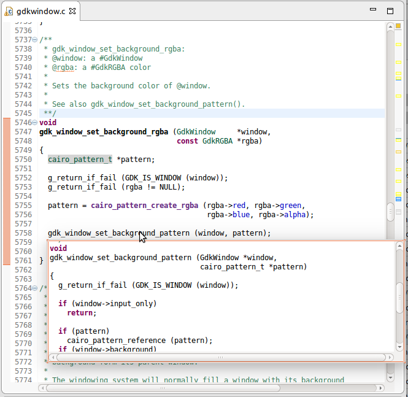
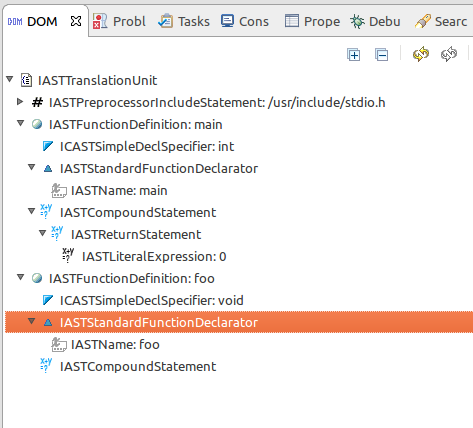

% title: Exploring CDT Core
% subtitle: The brain behind the C/C++ Editor
% author: Marc-André Laperle

---
title: The C/C++ Editor

Has many features:

- Code completion
- Syntax and semantic coloring
- Source hover
- Refactoring
- Macro expansion
- Navigation
- Static code analysis
- Markers
- etc

---

title: Editor feature implementation

Most features use these frameworks:

- Editor framework from Platform UI
- AST: Abstract syntax tree (the 'physical' model)
- DOM: Document object model (the semantic model)
	- PDOM: Persistent DOM, aka the index

---

title: CODAN

**COD**e **AN**alysis

A static code analysis framework. A **checker** reports errors in the Problems view and editor.

Can be invoked in various ways:

- On demand (right-click Run analysis)
- On Open/Save in the editor (good for external tool integration)
- As you type (quite useful)
- Build (incremental, full)

---

title: Can be implemented at various approaches:

- File level ("plain text"): Use path of file to read line by line using Java APIs
- AST: Use CDT's AST to analyze the source file at a structural level.
- DOM: Use CDT's DOM to analyze at a semantic level.

Often AST and DOM(index) are used in combination, hence the class AbstractIndexAstChecker.
We will make use of all three approaches in the exercises.

---

title: Exercises

**Project 1**

Warn if the file is longer than a set number of lines. This will only use normal Java libraries to analyze the code.

**Project 2**

Warn if code is too complex. We will consider code too complex when it has deep nesting of if/else/for/while. This will use the AST.

**Project 3**

Error if a method override another method but with the wrong return type.

---

title: Project 1

Description:

Warn if the file is longer than a set number of lines. This will only use normal Java libraries to analyze the code.

---

title: Project 1
subtitle: Step 1: Creating the checker skeleton

- Reset to **CODAN1.1**
- Already created a new plugin
- In MANIFEST.MF, add cdt.codan.core dependency
- Create a new checker in extension tab
	- Fill the 'class' field (use class hyperlink). In class creation dialog, remove IChecker interface, use AbstractCheckerWithProblemPreferences as superclass. We can call the class LineCountChecker
	- Fill id (unique) and name
- **Go!**

You should have a new LineCountChecker class that extends AbstractCheckerWithProblemPreferences and overrides the processResource method

<pre class="prettyprint">
	@Override
	public boolean processResource(IResource resource) throws OperationCanceledException {
		return false;
	}
</pre>

---

title: Project 1
subtitle: Step 2: Detect the problem

- Reset to **CODAN1.2**
- Check if it should report problem with call to shouldProduceProblems() (method in the base class) and early return
- Check if the resource is a IFile instance and cast to it. 

<pre class="prettyprint">
if (resource instanceof IFile) {
   IFile file = (IFile) resource;
}
</pre>

- From the IFile, count the number of lines by reading lines one by one.
- Print total to console

Test it: Start your second Eclipse (Run CDT). Import the testCodeAnalysis project. Rright-click on complex.cpp, Run C/C++ Code analysis. You should see the print-out on the console.

---

title: Project 1
subtitle: Step 3: Report the problem

- Reset to **CODAN1.3**
- Create a problem to will be reported (extension)
	- Fill the name, **id** (unique)
	- Category: click browse, look for code style
	- messagePattern: File is too long!
	- marker type: click browse, look for codan problem
- Report the problem (when 100 lines is reached)

<pre class="prettyprint">
reportProblem(FILE_TOO_LONG_PROBLEM_ID, file, 1); // id has to be the same as the problem id in plugin.xml
</pre>

Test it: Run it on loooong.cpp and a warning should appear!

---
title: Project 1
subtitle: Step 4: Add a preference

- Reset to **CODAN1.4**
- Add a preference for the number of lines. Call addPreference in initPreferences.
- Use the preference value instead of '100' in the code that detects the problem

<pre class="prettyprint">
@Override
public void initPreferences(IProblemWorkingCopy problem) {
	super.initPreferences(problem);
	addPreference(problem, PARAM_MAX_LINE_COUNT, "Max line count", Integer.toString(100));
}

final IProblem problem = getProblemById(FILE_TOO_LONG_PROBLEM_ID, file);
String parameter = (String) getPreference(problem, PARAM_MAX_LINE_COUNT);
int maxLineCount = Integer.parseInt(parameter);
</pre>

- BONUS: Let the user know what the limit is in the problem message. Use {0} in messagePattern to set a parameter and call reportProblem with another parameter.
---

title: What is the AST?

Abstract Syntax Tree.

Tree of nodes representing the "physical" structure of a source file. Example:

#include <stdio.h> 
 
int main() { 
return 0; 
} 
 
void foo() { 
 
} 

---

title: Navigating the AST

2 ways to navigate the AST:

- get() methods
- Visitor pattern (the recommended way)

How to use a visitor:

- You create a visitor and specify what you would like to visit (types of nodes)
- When a desired node type is visited, the visit() method is called on your visitor with the node passed as argument
- Inside the visit method this is where the node can be analysed
- The visitor can choose to skip the children of that node or continue

---

title: AST Example

<pre class="prettyprint" data-lang="java">
class MethodFinder extends ASTVisitor {
	{
		shouldVisitDeclarators = true;
	}

	@Override
	public int visit(IASTDeclarator declarator) {
		// do something with the declarator
		return PROCESS_CONTINUE;
	}

	@Override
	public int leave(IASTDeclarator declarator) {
		return PROCESS_CONTINUE;
	}
}

void analyseFile(IASTTranslationUnit translationUnit) {
	translationUnit.accept(new MethodFinder());
}
</pre>

---

title: Project 2

Warn if code is too complex. We will consider code too complex when it has deep nesting of if/else/for/while. This time, we will make use of CDT's AST to analyze the code. We will be able to analyze based on nodes in a tree instead of plain text.

<pre class="prettyprint">
void complexFunction() {
	int i = 0;
	if (i == 0) {
		if (i == 0) {
			if (i == 0) {
				if (i == 0) {
				...
</pre>

---

title: Project 2
subtitle: Step 1: Create the visitor

- Reset to **CODAN2.1**

- ComplexityChecker class is already created but this time, it uses AbstractIndexAstChecker
- With complex.cpp opened, open the DOM AST view to explore the various node types. What should be useful?
- Create a visitor (extend ASTVisitor), make the root accept it. Visit only interesting nodes.
	- Hint: if/for/while statements (IASTIfStatement, etc) have the same parent class
	- Override the visit() method for the type of node desired
	- Set the boolean 'shouldVisitSomething' to true in the ASTVisitor instance
- **Go!**

---
title: Project 2
subtitle: Step 2: Track complexity and report

- Reset to **CODAN2.2**

- Increment level of complexity (int) when visiting a 'complexity' node, decrement on leave
- Create and report the problem. Use the node's location to report at the correct line.
	- To get the line of the stement, you can use statement.getFileLocation().getStartingLineNumber()
- Prevent more errors in deeper levels of children. I.e. do not "continue" after reporting
	- To do this, 'skip' this node by returning PROCESS_SKIP
- Bonus: Create a preference for the complexity level
- **Go!**

---
title: What is the DOM?

Document Object Model.

Each name in the AST has a "IBinding" that represents the semantics of the name.

AST + Bindings = DOM

Example of AST nodes vs binding: In a source file, printf is used in several places.

- Each individual call to printf is a node in the AST
- All printf nodes have a name that resolve to the same binding: an IFunction

---

title: The index (PDOM)

DOM bindings are stored on disk to prevent re-parsing.

This data is called the Persistent DOM (PDOM) and often referred as just "the index".

- Parsing all files == indexing
- Quite fast reads, BTree
- Bindings have equivalent PDOM classes, example CFunction gets stored as PDOMCFunction
- Stores references to names and more. (Find references, Call hierarchy, etc)

---

title: Project 3

We will create a checker that will display an error if a method override another method but with the wrong return type.

<pre class="prettyprint">
class Base {
	virtual int bar();
	virtual ~Base();
};

class Child : public Base {
	float bar();
};
</pre>

---
title: Project 3
subtitle: Approach

- For each method declarator node in the AST
- Get its binding (ICPPMethod)
- Get its owner class (ICPPClassType)
- Check for name return type conflict with the base methods
- Report the error at the location of the AST node

(There are multiple ways do to this)

---
title: Project 3
subtitle: Step 1: Create the visitor

- Reset to **CODAN3.1**
- ReturnTypeChecker class is already created, it uses AbstractIndexAstChecker
- Create visitor. Visit only interesting nodes of the AST (IASTDeclarator)
	- Override the visit(IASTDeclarator)
	- Set the boolean 'shouldVisitDeclarators' to true in the ASTVisitor instance
- Get its binding using getName().getBinding() 
	- Make sure it's a method instance (ICPPMethod) then call checkConflictingReturn
	- print to console the name of the ICPPMethod, using getName
- **Go!**

Open classes/Child.cpp to set the results (on the console)

---
title: Project 3
subtitle: Step 2: Detect conflicting return type

- Reset to **CODAN3.2**
- Get the class owner using **getClassOwner** (class type) of the method
- Get all base methods by calling getAllBaseMethods (provided)
- Iterate through all base methods
	- Check that the base method name is the same and is virtual
	- Check that the return types are not the same
- **Go!**

---
title: Project 3
subtitle: Step 3: Report problem

- Reset to **CODAN3.3**
- Create (extension) and report the problem (reportProblem)
	- Fill the name, **id** (unique)
	- Category: click browse, look for Compiler Errors
	- messagePattern: Invalid return type for overriden method.
	- marker type: click browse, look for semantic problem
	- Use the node to report at the correct line.
- BONUS: Let the user know which type it should be in the problem message. Use {0} in messagePattern to set a parameter and call reportProblem with additional parameter. ASTTypeUtil.getType should help get the type name.
- **Go!**

---
title: Code Examples
subtitle: Source Hover (CSourceHover.java)

<pre class="prettyprint" data-lang="java">
public IStatus runOnAST(ILanguage lang, IASTTranslationUnit ast) {
	if (ast != null) {
		try {
			IASTNodeSelector nodeSelector = ast.getNodeSelector(null);
			if (fSelection.equals(Keywords.AUTO)) {
				...
			} else {
				IASTName name= nodeSelector.findEnclosingName(fTextRegion.getOffset(), fTextRegion.getLength());
				if (name != null) {
					IASTNode parent = name.getParent();
					if (parent instanceof ICPPASTTemplateId) {
						name = (IASTName) parent;
					}
					IBinding binding= name.resolveBinding();
					if (binding != null) {
						// Check for implicit names first, could be an implicit constructor call.
						if (name.getParent() instanceof IASTImplicitNameOwner) {
							IASTImplicitNameOwner implicitNameOwner = (IASTImplicitNameOwner) name.getParent();
							IASTName[] implicitNames = implicitNameOwner.getImplicitNames();
							if (implicitNames.length == 1) {
								IBinding implicitNameBinding = implicitNames[0].resolveBinding();
								if (implicitNameBinding instanceof ICPPConstructor) {
									binding = implicitNameBinding;
								}
							}
						}
</pre>

---

<pre class="prettyprint" data-lang="java">
	if (binding instanceof IProblemBinding) {
		// Report problem as source comment.
		if (DEBUG) {
			IProblemBinding problem= (IProblemBinding) binding;
			fSource= "/* Problem:\n" + //$NON-NLS-1$
					" * " + problem.getMessage() +  //$NON-NLS-1$
					"\n */"; //$NON-NLS-1$
		}
	} else if (binding instanceof IMacroBinding) {
		fSource= computeSourceForMacro(ast, name, binding);
	} else if (binding instanceof IEnumerator) {
		// Show integer value for enumerators (bug 285126).
		fSource= computeSourceForEnumerator(ast, (IEnumerator) binding);
	} else {
		fSource= computeSourceForBinding(ast, binding);
	}
}
</pre>

---
title: Code Examples
subtitle: Implement method (ImplementMethodRefactoring.java)

<pre class="prettyprint" data-lang="java">
private List<IASTSimpleDeclaration> findUnimplementedMethodDeclarations(IProgressMonitor pm) throws OperationCanceledException, CoreException {
	final SubMonitor sm = SubMonitor.convert(pm, 2);
	IASTTranslationUnit ast = getAST(tu, sm.newChild(1));
	final List<IASTSimpleDeclaration> list = new ArrayList<IASTSimpleDeclaration>();
	ast.accept(new ASTVisitor() {
		{ shouldVisitDeclarations = true; }
		@Override
		public int visit(IASTDeclaration declaration) {
			if (declaration instanceof IASTSimpleDeclaration) {
				IASTSimpleDeclaration simpleDeclaration = (IASTSimpleDeclaration) declaration;
				if (NodeHelper.isMethodDeclaration(simpleDeclaration)) {
					IASTDeclarator[] declarators = simpleDeclaration.getDeclarators();
					IBinding binding = declarators[0].getName().resolveBinding();
					if (isUnimplementedMethodBinding(binding, sm.newChild(0))) {
						list.add(simpleDeclaration);
						return ASTVisitor.PROCESS_SKIP;	
					}
				}
			}
			return ASTVisitor.PROCESS_CONTINUE;
		}
	});
	return list;
}
</pre>

---

<pre class="prettyprint" data-lang="java">
private boolean isUnimplementedMethodBinding(IBinding binding, IProgressMonitor pm) {
	if (binding instanceof ICPPFunction) {
		if (binding instanceof ICPPMethod) {
			ICPPMethod methodBinding = (ICPPMethod) binding;
			if (methodBinding.isPureVirtual()) {
				return false; // Pure virtual not handled for now, see bug 303870
			}
		}
		
		try {
			return !DefinitionFinder.hasDefinition(binding, refactoringContext, pm);
		} catch (CoreException e) {
			CUIPlugin.log(e);
		}
	}
	
	return false;
}
</pre>

---

<pre class="prettyprint" data-lang="java">
private IASTDeclaration createFunctionDefinition(IASTTranslationUnit unit, IASTSimpleDeclaration methodDeclaration, InsertLocation insertLocation) throws CoreException {
	IASTDeclSpecifier declSpecifier = methodDeclaration.getDeclSpecifier().copy(CopyStyle.withLocations);
	ICPPASTFunctionDeclarator functionDeclarator = (ICPPASTFunctionDeclarator) methodDeclaration.getDeclarators()[0];
	IASTNode declarationParent = methodDeclaration.getParent();
	String currentFileName = declarationParent.getNodeLocations()[0].asFileLocation().getFileName();
	if (Path.fromOSString(currentFileName).equals(insertLocation.getFile().getLocation())) {
		declSpecifier.setInline(true);
	}
...
	ICPPASTQualifiedName qName = createQualifiedNameFor(functionDeclarator, declarationParent, insertLocation);
	createdMethodDeclarator = nodeFactory.newFunctionDeclarator(qName);
	createdMethodDeclarator.setConst(functionDeclarator.isConst());
	createdMethodDeclarator.setRefQualifier(functionDeclarator.getRefQualifier());
</pre>

---
title: Code Examples
subtitle: Override markers (OverrideIndicatorManager.java)

<pre class="prettyprint" data-lang="java">
class MethodFinder extends ASTVisitor {
	{
		shouldVisitDeclarators = true;
	}

	@Override
	public int visit(IASTDeclarator declarator) {
		if (!(declarator instanceof ICPPASTFunctionDeclarator)) {
			return PROCESS_CONTINUE;
		}
		IASTDeclarator decl = ASTQueries.findInnermostDeclarator(declarator);
		IASTName name = decl.getName();
		if (name != null) {
			IBinding binding = name.resolveBinding();
			if (binding instanceof ICPPMethod) {
				ICPPMethod method = (ICPPMethod) binding;
				try {
					ICPPMethod overriddenMethod = testForOverride(method, declarator);
					if (overriddenMethod != null) {
						try {
							ICElementHandle baseDeclaration = IndexUI.findAnyDeclaration(index, null, overriddenMethod);
							if (baseDeclaration == null) {
								ICElementHandle[] allDefinitions = IndexUI.findAllDefinitions(index, overriddenMethod);
								if (allDefinitions.length > 0) {
									baseDeclaration = allDefinitions[0];
								}
							}
							
							OverrideIndicator indicator = new OverrideIndicator(annotationKind, annotationMessage, baseDeclaration);
							
							IASTFileLocation fileLocation = declarator.getFileLocation();
							Position position = new Position(fileLocation.getNodeOffset(), fileLocation.getNodeLength());
							annotationMap.put(indicator, position);
						} catch (CoreException e) {
						}
					}
				} catch (DOMException e) {
				}
			}
		}
		return PROCESS_CONTINUE;
	}
</pre>

---

<pre class="prettyprint" data-lang="java">
ICPPMethod overriddenMethod = testForOverride(method, declarator);
if (overriddenMethod != null) {
	try {
		ICElementHandle baseDeclaration = IndexUI.findAnyDeclaration(index, null, overriddenMethod);
		if (baseDeclaration == null) {
			ICElementHandle[] allDefinitions = IndexUI.findAllDefinitions(index, overriddenMethod);
			if (allDefinitions.length > 0) {
				baseDeclaration = allDefinitions[0];
			}
		}
		
		OverrideIndicator indicator = new OverrideIndicator(annotationKind, annotationMessage, baseDeclaration);
		
		IASTFileLocation fileLocation = declarator.getFileLocation();
		Position position = new Position(fileLocation.getNodeOffset(), fileLocation.getNodeLength());
		annotationMap.put(indicator, position);
</pre>

---
title: Code Examples
subtitle: Semantic highlighting (SemanticHighlightings.java)

<pre class="prettyprint" data-lang="java">
/**
 * Semantic highlighting for namespaces.
 */
private static final class NamespaceHighlighting extends SemanticHighlightingWithOwnPreference {
	@Override
	public RGB getDefaultDefaultTextColor() {
		return RGB_BLACK;
	}
...
	@Override
	public boolean consumes(ISemanticToken token) {
		IBinding binding= token.getBinding();
		if (binding instanceof ICPPNamespace) {
			return true;
		}
		return false;
	}
}
</pre>

