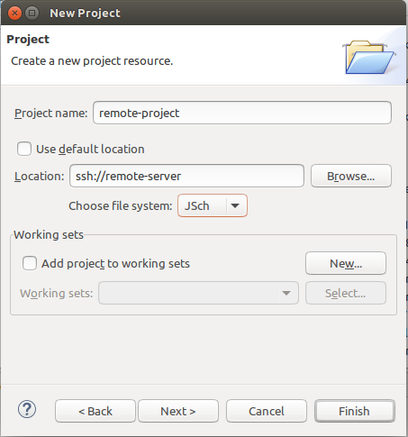
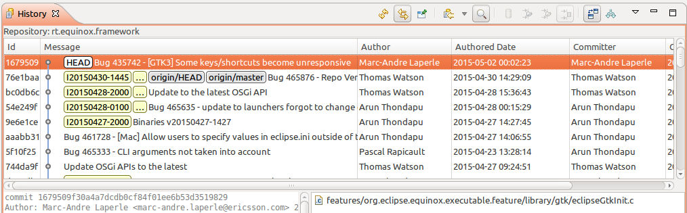
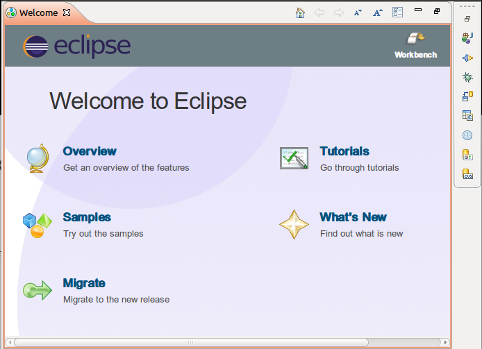
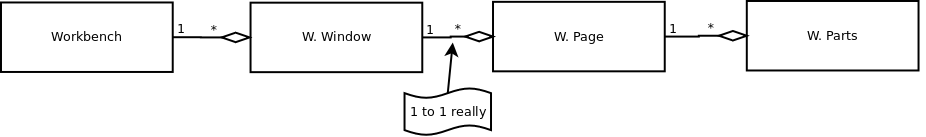
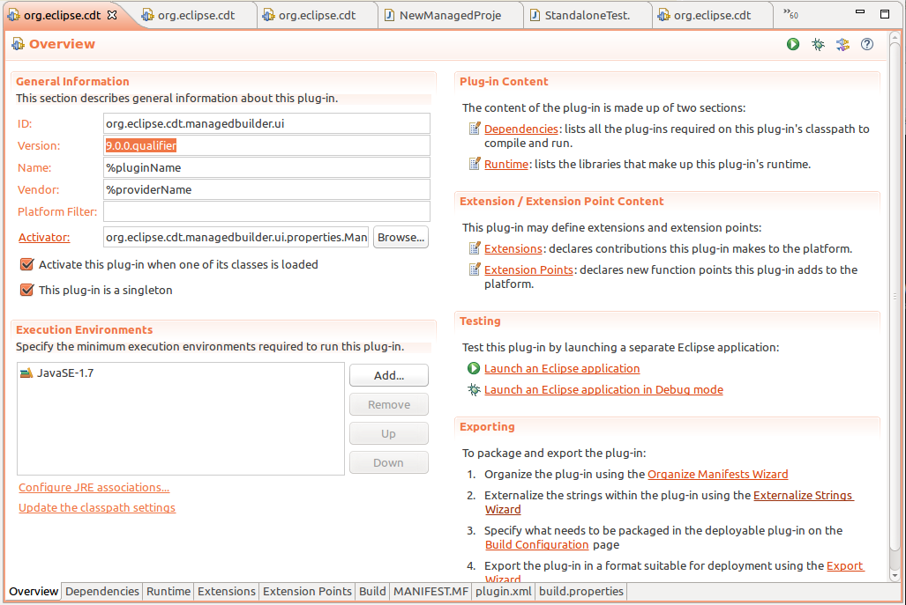
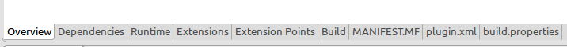
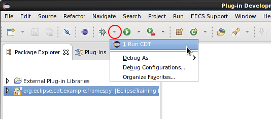

% title: Eclipse Plug-in Development
% title_class:                  #empty, largeblend[123] or fullblend
% subtitle: Extending the CDT Debugger
% subtitle_class:
% title_slide_class:
% title_slide_image:
% author: Marc Khouzam
% author: Marc-André Laperle
% thankyou_blend: largeblend3       #largeblend[123] or fullblend
% thankyou_details:
% mail1: marc.khouzam@ericsson.com
% mail2: marc-andre.laperle@ericsson.com
% phone:
% sms:
% lync:
% footer: Ericsson
% footer: 2016-02-08
% logoslide: false      # Show a logo slide as the first slide. Also affected by % animate
% useBuilds: true
% animate: true         #animate logoslide (chrome only)
% aspect_ratio: 4:3     #16:9, 16:10 or 4:3

[//]: (Start presentation in Presenter mode by adding ?presentme=true to URL)
[//]: (Make sure pop-ups are allowed, then keep pop-up on my own screen)
[//]: (then press 'p' for presenter mode for my screen while showing)
[//]: (main browser window on projector)
[//]: (turn off by adding ?presentme=false to URL)

---
title: Who we are

- Marc-André Laperle
    - Software Developer at Ericsson since 2013
    - Worked in various software development positions (Web, Gaming)
    - Eclipse Committer for Trace Compass, CDT Linux Tools and Orbit
    - Occasional contributor to other projects (Platform UI, SWT, EGit, Mylyn, PDE, Oomph)

- Marc Khouzam
    -

---
title: Agenda
class: nobackground
build_lists: false
content_class:

- Monday: Plugin development
    - Module 1: Eclipse Platform and plug-in development
    - Module 2: Implementing a first plug-in
- Tuesday: Getting to know DSF
    - Module 3: DSF concepts and exercises
    - Module 4: DSF events and exercises
- Wednesday: Getting to know DSF-GDB
    - Module 5: DSF-GDB concepts and exercises
    - User meeeting

---
title: Agenda (cont)
build_lists: false

- Thursday: Modifying DSF-GDB's behaviour
    - Module 6: Changing the Debug View
    - Module 7: Changing GDB's initialization
- Friday: Trace Compass + CDT Editor/Codan
    - Module 8: Trace Compass introduction and demo
    - Module 9: Extending the CDT Editor using Codan
      
##
Let's get started!

[//]: (This is a comment)

---
title: Approach to course

- Much hands-on
- Teams of 2
- Presentation of exercise result by a team
- Ask questions
- We will adapt to feedback
- 9h to 16h
- 15 minute break morning and afternoon

---
title: Final setup

- *~/workspace-training/start.tcsh*
- Select workspace: *~/workspace-training*

---
title: DAY 1
subtitle: Plugin development

- Intro to Eclipse Platform
  
- Plug-in development
  
- Exercises

---
title: The Eclipse Platform

The Platform defines the set of frameworks and common services that collectively make up infrastructure required to support the use of Eclipse as a component model, as a **Rich Client Platform (RCP)** and as a comprehensive **tool integration platform**.

---
title: The Eclipse Platform

---

title: Eclipse Runtime

Mainly composed of the Eclipse Equinox project.

Eclipse Equinox:

- Implements the OSGI specification (modules, services, etc)
- P2: Provisioning framework. Installs new plug-ins, resolves dependencies, etc.
- Miscellaneous Core functionallity like the extension registry (plugins), Jobs, Preferences, etc.
- Eclipse launcher (native)

---

title: Workspace

- The workspace is a view of the user's data files: the resources.
- Types of resources: projects, folders, and files
- Only one workspace per running platform
- Structure: Workspace root > Projects > IFolders or IFiles
- Common classes:
	- IResource
	- IWorkspace
	- IFile
 	- IFolder
	- IProject
- Resoure names and their paths in the workspace to not have to match the location on the filesystem

---
title: Workspace

Other features than navigation/listing:

- Markers: to display problems like compilation errors
- Properties: per-file storage. Think flags like "read-only" but more customizable.
- Virtual folders: for greater flexibility when organizing projects
- Project natures: to differentiate between different kind of projects (Java, C/C++)
- Resource deltas: Listen to file modification, creation, deletion, etc.

---
title: EFS

Eclipse File System (EFS).

- An abstract file system API
- The Workspace resources sit on top of EFS
- The default implementations is for Local file systems
- Other implementations: SSH, FTP, dstore, ZIP, etc.

---
title: Eclipse Team

Framework to integrate SCMs.

- Repository configuration
- Resource management: Hooks for delete, move, add. Decorators in the UI.
- Synchronization: tracks whether or not resources are in sync. Local history.
- Logical Model Integration: Operate at the model level instead of per-file.
- Views: Synchronize, History, etc.

EGit, CVS, Subversion, Perforce use this.

---
title: Eclipse Help

- Table of content, Search, indexed
- Context sensitive (F1). Plugins can set context "ids"
- Runs on a local server, either in internal browser (SWT wiget) or external

Other "User Assistance" features

- Cheat cheets
- Welcome page
- Tutorials

---
title: SWT

Standard Widget Toolkit (org.eclipse.swt.*)

A Java library of widgets aimed at providing efficient, portable access to the user-interface facilities of the operating systems on which it is implemented.

This is typically the lowest level of UI programming done in Eclipse development.

---
title: SWT
subtitle: Features

- Native look
- Quite fast!
- Button, Text, Browser, Group, Table, Tree, etc.
- Parent is specified in constructor (versus add child to parent container explicitly)<
- Can be used as a stand-alone Java library (without anything else Eclipse)

---
title: SWT
subtitle: Implementation

- Single UI thread
- Implemented using JNI calling the OS native library (which means SWT has some native glue code)
	- Windows: Win32
	- Mac: Cocoa
	- Linux: GTK2 and GTK3
- Browser widget is integrated with different libraries: Webkit, Internet Explorer, XULRunner (Firefox)
- Most crashes (i.e. segmentation fault) in Eclipse due to native libraries called by SWT
	- GTK, WebKitGTK+, Ubuntu-specific libraries (Unity)
- A bit hard (but fun) to debug. Java + Native C
---
title: JFace

JFace is a UI toolkit with classes for handling many common UI programming tasks. It is designed to work with SWT without hiding it.

org.eclipse.jface.*

Common uses:

- Viewers: TreeViewer, TableViewer, etc.
- Dialogs: Message dialog, error dialog, etc.
- Wizards: Wizard dialog, pages

---
title: Workbench

org.eclipse.ui.*

This is where classes more related to the common IDE UI fonctionality reside.

---
title: Workbench

- A <b>Workbench</b> has one or more workbench windows.

- Each Workbench <b>Window</b> has workbench pages.

- Each Workbench <b>Page</b> has workbench parts, of which there are two kinds: views and editors.

- Each Workbench <b>Part</b> is either a <b>View</b> or an <b>Editor</b>.

 

---
title: Workbench

Common uses:

- Views: IViewPart and the extension point org.eclipse.ui.views
- Commands and Handlers: org.eclipse.ui.commands, org.eclipse.ui.handlers extension points.
- Preference pages: org.eclipse.ui.preferencePages extension point
- Editors: org.eclipse.ui.editors extension point. IEditorPart and useful classes like TextEditor

---
title: The Eclipse SDK

To be able to work program with the Eclipse Platform, you need tools.

=+ 

The Eclipse SDK = Platform (including source) + JDT + PDE

---
title: JDT: Eclipse Java development tools

Those are the tools suitable for any Java-based programming

---
title: PDE: Plug-in Development Environment

Provides tools to create, develop, test, debug, build and deploy Eclipse plug-ins.

---
title: Project for exercices

We will create a new view that will display a log of every function:line that the debugger stops at.

---
title: What IS an Eclipse plugin?

It's an OSGI bundle, a java module.
But with an Eclipse flavor. Among other things:

- Specifies dependencies to other plugins
- Uses extensions to plug into existing extension points
- Can define new extension points for others to extend 
- Specifies what to package in the (Jar)
- Specifies the execution environment (Java 7, 8, etc).

Difference between extension and extension point?

Extension = plug 
Extension point = socket

A lot of things are done through extension points. For that, we need a plugin.

---
title: Exercise: Create a plugin

- Go to Plug-in Development perspective
- File > New > Plug-in project
- Name your plugin (org.eclipse.cdt.example.framespy)
- Press Next then Finish
- <b>Go!</b>

What are all the tabs for?

---
title: Step to prepare

- Since we want to use the Git repo, delete the project and import existing one.
    - Right-click on your project and press Delete then press OK
- Go to *Git perspective*
    - In *Git Repositories* right-click and choose *Remove Repository from View*

---
title: Step to prepare (2)

- Go to *Plug-in Development perspective*:
    - *File->Import...->General->Existing Projects into Workspace*
    - Press *Next*
    - Press *Browse...*
    - Choose *~/workspace-training/EclipseTraining/org.eclipse.cdt.example.framespy*
    - Make sure a single project is showing and is selected
    - Press *Finish*

- Right-click on project and choose *Team->Fetch from Upstream*

---
title: Exercise: Create a view

- Reset to **PLUG1**
- Add a new view by adding an extension (plugin.xml)
- Create the view class (tip: click the hyperlink to bring up the New Class wizard)
- Make sure the view has an id, name
- To test your progress 

 

- <b>Go!</b>

---
title: SWT Basic widget creation

~~~~{java}
Text textBox = new Text(parentComposite, SWT.SOMESTYLE | SWT.OTHERSTYLE);
textBox.set*Somesetter*
textBox.add*Somelistener*
~~~~

Composite are containers of widgets that can be layed out.

Composites can be in composites!

---
title: Exercise: Add button to view

Let's add a Button. Let's make it a checkbox button.

- Reset to **PLUG2**
- In view class, in createPartControl() add new Button with a "checkbox style"
- Add selection listener to detect when it's pressed
- Output something to the console
- <b>Go!</b>

But the button does not belong in view itself, it would be nicer in the toolbar. 
---
title: Eclipse commands and handlers

The Commands framework is a way to add user actions to the user interface.
A command has:

- An id that declares a semantic behavior
- One or more handlers

For example, the Copy command has the id *org.eclipse.ui.edit.copy*. But it has many handlers that behave differently depending on the context (selection, view)

---
title: Exercise: Create the command and handler

- Reset to **PLUG3**
- Add a command extension to toggle log on/off
- Create a defaultHandler class (tip: use hyperlink to create class). Make it extend AbstractHandler
- Implement the execute method to make it print something to the console
- <b>Go!</b>
---
title: The menus extension point

The org.eclipse.ui.menus extension point can add commands to:

- Main menu (menu)
- Main toolbars (toolbar)
- View context menus (popup)
- View toolbars (toolbar)
- View menus (menu)

It has an odd **locationURI** field: &nbsp;[Scheme]:[ID]?[placement]

For example:

~~~~
menu:org.eclipse.ui.main.menu?after=additions
~~~~

---
title: Exercise: Add toolbar button

Let's add the command to the view toolbar.

- Reset to **PLUG4**
- Create the menus extension
- Add a menuContribution, set the locationURI so that it gets displayed in the view toolbar, after additions
- Add a command under the contribution. Set the id, icon and style (push)
- <b>Go!</b>

It would be nice in the context menu as well. 

---
title: Exercise: Context menu

Let's add the same command in the context menu.

- Reset to **PLUG5**
- Add a new menuContribution. Because it needs different locationURI. 
- Add the command. Set the id, icon and style (push)
- Create a context menu in the view:
~~~~{java}
fMenuManager = new MenuManager();
Menu menu = fMenuManager.createContextMenu(composite);
composite.setMenu(menu);
getViewSite().registerContextMenu(fMenuManager, null);
...
fMenuManager.dispose();
~~~~

- <b>Go!</b>
---
title: Exercise: Show the toggle state

The user needs to see whether logging is enabled or not.

Let's add a label that displays that.

- Reset to **PLUG6**
- Add a Label (a SWT widget) at the view creation.
- When the command executes:
	- Set the toggle state (you can add a method to the view)
	- Update the label text

- <b>Go!</b>

If you enable logging and close/reopen the view, what happens?
---
title: The Preference Store

We should make sure that the toggle state is remembered when the view is closed (or Eclipse is restarted). There are multiple ways to do this. A useful one is the Preference Store. 

- Works like a key/value map
- Can be applied to different scopes:
	- DefaultScope: When the user presses "restore defaults" it restores to this.
	- InstanceScope: Saved at the workspace level. Overrides Default.
	- ProjectScope: Saved at the project level. Overrides Instance.
	- Custom!
- Organized in nodes (think namespaces). Typically the plugin id.
---
title: Exercise: Persist the toggle state

- Reset to **PLUG7**
- When the toggle state is set:
	- Get the InstanScope
	- Get the node
	- Set the key/value
- When the view is created:
	- Get the InstanScope
	- Get the node
	- Get value using key, set the label text

- <b>Go!</b>

---
title: Eclipse Jobs

Jobs are similar to Java Thread but have Eclipse flavor.

Some differences:

- Scheduling rules: determine which jobs can run concurrently
- Deadlock detection: and recovery (ILock)
- Shown in the Progress View to the user (or not) with progress (IProgressMonitor)
- Can be made cancellable by the user
- Returns a status (IStatus)

In Eclipse code, Jobs and Threads are both commonly used, depending on the situation.

For the first implementation of our logging feature, we will poll every one second using a job.

---
title: Exercise: Creating a polling job

- Reset to **PLUG8**
- When toggle state is on, create and schedule a job
	- Give the job a nice name to be shown in the Progress View
- In the job run() method, sleep for 1 sec
- After the 1 sec, reschedule the job (only if the toggle state is still on!).
- Print something to the console every tick "polling..."
- <b>Go!</b>

---
title: Exercise: Print to view

Every tick, we would like to show the elapsed time in the view. It can just be a 

- Reset to **PLUG9**
- Create a counter (a simple int) that is incremented each tick.
- Set the text label with the value of the counter
- <b>Go!</b>

What happens?
---
title: SWT Display and the UI thread

Changes to the UI (widgets) should always be done on the UI thread.

The Display implements the event loop. There is only one instance in a running Eclipse.
 
~~~~
Display.getDefault().asyncExec // Execute code at the next reasonable opportunity. Caller continues in parallel.
Display.getDefault().syncExec // Blocks calling thread until executed on UI thread
~~~~

With this knowledge we can fix the Invalid Thread Access. We can use asyncExec in this case. (**PLUG10**)
---
title: Exercise: Handle cancel

An IProgressMonitor is passed to the job.

We can use it to know if the user canceled the logging.

- Reset to **PLUG10**
- Use monitor.isCanceled() to know when user canceled
- Set the toggle state to off when canceled
- <b>Go!</b>

What happens? Do you have a problem with the job starting again?
If you need results from UI thread right away -> syncExec

---
title: Exercise Review
subtitle: What we accomplished

- Create a plug-in
- Create a view
- Use SWT widgets
- Use commands and handlers
- Use menu extension (context menu and toolbar)
- Use the preference store
- Use Jobs and Progress Monitors

---
title: DAY 2
subtitle: Getting to know DSF

---
title: Module 3

  
- Eclipse Debug Platform
  
- What is DSF?
  
- DSF concepts applied
  
- DSF Exercise 1

---
title: Building on our new view

1. Debug Frame Spy
    - New view logging each `method:line` at which the debugger stopped. 

---
title: Debug Frame Spy Details

1. Show list of method name and line number of each location program was interrupted
1. Show time of interrupt for each entry
1. Show the number of arguments of the function for each entry

---
title: Eclipse Debug Platform

- Eclipse provides a foundation for Debugging
    - Debug perspective
    - Debug views
    - Debug Actions, Toolbar, Menus
    - Debug Launching

++Notes++
- Debug perspective manual or automatic selection
- *Windows->Show View->Other... and expand Debug folder*
- Each view has toolbar actions, context-menu, view-menu
- Launch configuration types, launch configurations
++++

---
title: What is DSF?

- Overview
- View Model and Data Model
- Services
- Data Model contexts
- DSF Executor thread
- DSF Session
- Asynchronous (callback) programming

---
title: DSF Overview

- API for integrating debuggers in Eclipse
- Also designed for efficiency (slow or remote targets)
- Figure shows typical debugger integration using DSF

---
title: View Model

- View Model provides layer of abstraction for views
    - *User-presentable* structure of the data
  
- View Model allows to easily modify presentation e.g.,
    - Hide running threads
    - Limit number of stack frames
    - Only show processes if there is more than one

++Notes++
- Show feature that hides running threads
- Show feature that limits number of stack frames
- In practice, we don't change the view model very often.  So this course will not cover it.
++++
---
title: Data Model

- Data Model deals directly with the backend debugger
    - *Natural* or *backend* structure of the data
    - Independent of presentation to user
    - Provides building blocks for the view model
    - Uses common debugger concepts
        - Execution elements (e.g., processes, threads)
        - Formatted values (e.g., variables, registers)
        - etc

++Notes++
- Mention frontend vs backend terminology
++++
---
title: DSF Services

- DSF provides a service API to access the Data Model
  
- Built on top of OSGi (as Eclipse is)
  
- Services are entities managing logical subsets of the data model
  
- Services are used to request information or to perform actions
---
title: DSF Services (2)

- For example, the IRunControl service:
    - Provides list of execution elements (e.g., threads, processes)
    - Provides details about such elements (e.g., name, state)
    - Supports step, resume, interrupt, etc
  
- Other services: IMemory, IRegisters, IExpressions, IDisassembly...
  
- All services extend <code>IDsfService</code> (press *F4* on <code>IDsfService</code>)

---
title: Data Model Contexts

- IDMContext class is a 'pointer' to any type of backend data
    - IExecutionDMContext - thread, process, group
    - IFrameDMContext - stack frames
    - IBreakpointDMContext - breakpoint, tracepoint, dprintf
    - All contexts extend <code>IDMContext</code> (use *F4*)
  
- Contexts are hierachical
    - *process* -> *thread* -> *frame* -> *expression*
    - <code>DMContexts.getAncestorOfType()</code>
  
- Contexts are used to retrieve data from services

---
title: DSF Executor thread

- Accessing data from different threads requires synchronization
- DSF uses a single-threaded executor to avoid synchronization

---
title: DSF Session

- Instances of DSF services are grouped into a DSF session
  
- There can be multiple sessions running at the same time
  
- The session provides the DSF Executor (<code>DsfSession#getExecutor()</code>)
  
- A session handles sending events to registered listeners

---
title:  Asynchronous (callback) programming

- Most DSF APIs return void but indicate completion in a callback
  
- <code>RequestMonitor</code> is the main callback class
    - Remember to call <code>done()</code> when real work is finished
    - This calls: <code>handleCompleted()</code>, <code>handleSuccess()</code>, <code>handleError()</code>
  
- <code>DataRequestMonitor</code> to *"return"* a value
    - <code>getData()</code> to get that value

---
title: RequestMonitor example

- To call an asynchronous method, such as:
~~~~
void asyncCall(IDMContext dmc, RequestMonitor rm);
~~~~
- there are two main coding styles
~~~~
Declarative:
   RequestMonitor myRm =
           new RequestMonitor(getExecutor(), parentRm);
   asyncCall(dmc, myRm);

In-line:
   asyncCall(dmc, new RequestMonitor(getExecutor(), parentRm));
~~~~
---
title: Declarative Style

- First declare the RequestMonitor and what it should do
  
- Then call the asynchronous method, passing the RM
~~~~
   RequestMonitor myRm =
           new RequestMonitor(getExecutor(), parentRm) {
               @Override
               void handleSuccess() {
                   System.out.println("Async call succeeded");
                   parentRm.done();
               }
           };

   asyncCall(dmc, myRm);
~~~~
---
title: In-line Style

- Directly call the asynchronous method
  
- Declare and define the RM in-line 
~~~~
   asyncCall(dmc, 
             new RequestMonitor(getExecutor(), parentRm) {
                 @Override
                 void handleSuccess() {
                     System.out.println("Async call succeeded");
                     parentRm.done();
                 }
             });

~~~~
- *In-line* has the benefit of showing the execution flow
---
title: DataRequestMonitor

- Extention of <code>RequestMonitor</code> which *"returns"* data
~~~~
   DataRequestMonitor<String> parentRm =
              new DataRequestMonitor<String>(getExecutor, null);
   asyncCallWithData(
      dmc, 
      new DataRequestMonitor<String>(getExecutor(), parentRm) {
      @Override
      void handleSuccess() {
          String resultString = "Success with result " + getData();
          parentRm.done(resultString);
      }
   });
~~~~
---
title: Other RequestMonitors

- <code>CountingRequestMonitor</code> and <code>MultiRequestMonitor</code>
    - For multiple asynchronous request in parallel
  
- <code>ImmediateRequestMonitor</code> and similar
    - <code>handleSuccess()</code> and others are called on the thread where the ImmediateRM was created.

---
title: DSF concepts review
build_lists: true

1. APIs to integrate a debugger 'more easily' e.g., GDB
1. View Model for presentation layer
1. Data Model to communicate with backend (GDB)
1. Services API to access Data
1. No synchronization: DSF Executor **must** be used to access Data
1. Services for one backend are grouped in a Session
1. Heavy use of asynchronous programming for responsiveness

---
title: DSF practical review
build_lists: true

1. Services extend <code>IDsfService</code>
  
1. Contexts extend <code>IDMContext</code>
  
1. Context hierarchy searched with <code>DMContexts</code>
  
1. Executor can be found with <code>DsfSession#getExecutor()</code>
  
1. <code>RequestMonitor</code> and <code>DataRequestMonitor</code> for callbacks

---
title: DSF Exercise 
build_lists: true

- FrameSpy to periodically print "method:line" for current frame 
    - Reset branch to commit starting with
        - **DSF1_START** or **DSF1_ADVANCED**
  
    - To test, make sure you launch a C/C++ Debug session first
  
    - Use the **Tasks** view to see what needs to be done
  
    - **Go!**

++Notes++
- Show how to launch a C/C++ debug session (use non-stop first)
++++
---
title: Exercise review
build_lists: true

- Finding the DSF session using debug context
    - Debug View and Debug Context
    - Adapter pattern
  
- Calling an existing DSF service
    - Using a DsfServicesTracker for the DSF session
  
- Call the asynchronous IStack.getTopFrame()
    - Using a new DataRequestMonitor
    - Calling getData() in handledSuccess()
---
title: Exercise review (2)

- IDMContext vs IDMData
    - call IStack.getFrameData()
    - Using a new DataRequestMonitor
    - Calling getData() in handledSuccess()
    - Then finally display "method:line"

---
title: Exercise follow-up part 1
build_lists: true

- What if you select the process element?
    - The top frame of which thread should we use?
  
- For now, just handle the error (as seen on console)
    - Reset to **DSF1_ANSWERS** if you need
    - Override <code>handleError()</code>
    - **Go!**

---
title: Follow-up part 1 review

---
title: Exercise follow-up part 2

- Assertions are a great way to notice unexpected situations
  
- Enable assertions in development eclipse for test eclipse
    - In launch configuration, *Arguments* tab, *VM arguments*
    - Add *-ea*
    - Make sure you have a breakpoint for *AssertionError*
    - Re-launch and try
    - **Go!**

++Notes++
- Explain how to use assertions
++++

---
title: Exercise follow-up part 2

- Did you use the DSF Executor?
    - Which code runs on the Executor, which not?
  
- Wrap first call to DSF service in Executor
    - Call <code>submit()</code> of the Executor
    - Pass a <code>DsfRunnable()</code> whose <code>run()</code> does the work
    - **Go!**

---
title: Follow-up part 2 review

---
title: Which DSF concepts did we exercise?
build_lists: true

1. APIs to integrate a debugger 'more easily' e.g., GDB
1. View Model for presentation layer
1. Data Model to communicate with backend (GDB)
1. Services API to access Data
1. No synchronization: DSF Executor **must** be used to access Data
1. Services for one backend are grouped in a Session
1. Heavy use of asynchronous programming for responsiveness

---
title: Module 4
build_lists: true

- DSF Exercises 2 and 3

---
title: DSF Events

- DSF uses events to notify listeners of different things e.g.,
    - Thread/Process started/exited
    - Thread/Process suspend/resumed
    - Breakpoint added/updated/removed
    - etc

---
title: DSF Events (2)
build_lists: true

- Events are how the Data Model tells the View Model of changes
    - e.g., Thread stops => Update Debug View
    - View Model is an advanced topic not covered in this course
  
- Events also notify services of other services' changes
    - e.g., Clearing caches when execution resumes
---
title: DSF Events details

- Most events implement <code>IDMEvent</code> which provides an <code>IDMContext</code>
    - e.g., When thread suspends, event specifies which thread
  
- Event types usually found in the different service interfaces e.g.,
    - <code>IRunControl</code>:
        - <code>ISuspendedDMEvent</code>, <code>IContainerSuspendedDMEvent</code>
        - <code>IResumedDMEvent</code>, <code>IContainerResumedDMEvent</code>
  
- Not all services trigger events
    - <code>IStack</code> has not events
---
title: Sending DSF Events

   
- To send an event a service calls <code>DsfSession#dispatchEvent()</code>
---
title: Receiving DSF Events

- To receive a DSF events a client must:
    - Declare a **public** method of any name
    - Method takes the event of interest as a parameter
    - Annotate method with <code>@DsfServiceEventHandler</code>
    - Register with the DSF Session using <code>DsfSession#addServiceEventListener()</code>
    - Registration must be done on the Executor
  
- The method is called on the DSF Executor

++Notes++
- <code>dispatchEvent()</code> calls event listeners in a **separate** Runnable on the Executor.
    - This allows sender to finish its work before events are received by the listeners.
    - Event listener methods always called in the Executor thread.
++++
---
title: Receiving event example

- The following method from *SomeClass* will be called for every suspended event

~~~~
    @DsfServiceEventHandler
    public void anyName(ISuspendedDMEvent e) {
        System.out.println("Received " + e.toString());
    }
~~~~

- as long as we register the class with the session

~~~~
    getSession().addServiceEventListener(SomeClass.this, null);
~~~~

- Remember that registration must be done on Executor
---
title: Help with the Executor
build_lists: true

- DSF provides Java Annotations to guide with Executor use 
    - <code>@ThreadSafe</code>
        - Safe for any thread (synchronization used)
    - <code>@ConfinedToDsfExecutor(executor)</code>
        - Must use specified executor
    - <code>@ThreadSafeAndProhibitedFromDsfExecutor(executor)</code>
        - Safe for any thread **except** the specified executor
  
- They are hierarchical, so apply to children (e.g., methods of class)
  
- Unfortunetly, there is no compiler support so they are effectively just comments (that are sometimes missing)

---
title: DSF Event Exercise

- Show "method:line" each time a thread stops instead of polling
    - Reset branch to commit starting with
        - **DSF2_START** or **DSF2_ADVANCED**
        - Polling job has been removed for you
        - "method:line" only shown when FrameSpy first enabled
  
    - To test:
        - make sure your debug session is in Non-Stop mode
        - step program and check new "method:line"  each step
  
    - **Go!**

---
title: Event Exercise Review

- Registering for DSF events
    - addServiceEventListener() **using** the Executor
    - Must pass <code>FrameSpyView.this</code> (or another listener class)
  
- Unregister for DSF events when FrameSpy disabled
    - removeServiceEventListener() **using** the Executor
    - Must pass <code>FrameSpyView.this</code> (or listener used)
    
---
title: Event Exercise Review (2)

  
- Receiving the event

~~~~
@DsfServiceEventHandler
public void anyName(ISuspendedDMEvent event) {
    // Fetch frame info and print it
}
~~~~

---
title: Event Exercise for All-Stop

- <code>ISuspendedDMEvent</code> is used for Non-stop only
  
- <code>IContainerSuspendedDMEvent</code> for All-stop
    - Represents the process stopping
    - The top frame of which thread should we use?
  
- This event specifies which thread caused the stop
    - Use that **triggerring** thread (context)
    - (Look at declaration of <code>IContainerSuspendedDMEvent</code>)
    - Reset to **DSF2_ANSWERS**
    - **Go!**

---
title: All-Stop Exercise Review

---
title: Handling a new session

- FrameSpy has an important limitation now
    - enable FrameSpy
    - stop the session and start a new one
    - step the new session
    - **FrameSpy no longer prints**

---
title: Handling a new session (2)

  
  
  
#
**Why?**

---
title: Handling a new session (3)
build_lists: true

- When new session starts, we are not registered for its events
  
- How to know **when** new session starts so we can register?

---
title: DsfSession to the rescue

- DsfSession notifies registered listeners of start/end of all sessions
    - <code>addSessionStartedListener()</code>, <code>removeSessionStartedListener()</code>
    - <code>addSessionEndedListener()</code>, <code>removeSessionEndedListener()</code>
  
- DsfSession provides access to all running sessions:
    - <code>getActiveSessions()</code>, <code>getSession(id)</code>

---
title: Multiple Session Exercise

- Register for event for each new DSF session
    - Reset to **DSF3_START** or **DSF3_ADVANCED**
  
    - Listen for new session and register with them
  
    - Unregister when FrameSpy gets disabled
  
    - **Go!**

---
title: Sessions Exercise Review

---
title: DAY 3:
subtitle: Getting to know DSF-GDB

---
title: Module 5
build_lists: true

- What is DSF-GDB
  
- A little history
  
- DSF-GDB's service structure
  
- DSF Exercises 5 and 5

---
title: What is DSF-GDB

- Integration of GDB using DSF
    - Cannot use run DSF by itself
  
- Extra features on top of base DSF
    - Tracepoints
    - Visualizer
    - OS Resources

---
title: History of DSF-GDB

- How it started
  
- Ericsson's involvement
  
- GDB's evolution
  
- Default CDT Debugger integration
  
- Where we stand today

---
title: DSF-GDB's services

- DSF provides API for services
    - <code>IStack</code>, <code>IBreakpoints</code>, <code>IExpressions</code>, etc
  
- DSF-GDB provides an implementation
  
- Hierarchy of DSF-GDB services
    - Press *F4* on <code>IDsfService</code>
    - <code>MI[service]</code> vs <code>GDB[service]</code> (historical)
    - <code>GDB[service][version]</code>
    - <code>GDB[service]_HEAD</code>

---
title: New Service Exercise
build_lists: true

- Write a new service providing the current time
    - Reset to **DSF4_START** or **DSF4_ADVANCED**
  
    - **FrameSpyService.java** already created for you
  
    - Make it into a DSF service that can be found by name
  
    - Provide methods:
        - Synchronous <code>getLocalTimeOfDayString</code> method
        - Asynchronous <code>getTargetTimeOfDayString</code> method
  
    - **Go!**

---
title: New Service Review
build_lists: true

- <code>AbstractDsfService</code> can be used as a base class for services
  
    - Need to implement <code>getBundleContext()</code>
  
    - Need to advertise a service using <code>register()</code>
        - Any name can be used but class or interface name is good
  
    - <code>initialize()</code> and <code>shutdown()</code> should be enhanced
  
    - Some method providing the service functionality is needed

---
title: Asynchronous vs Synchronous API

- Slowest part of the CDT debugger is communication with GDB
    - DSF provides infrastructure for async communication
    - New async API can use that infrastructure
    - New sync API **cannot**
  
- Async API can be used synchronously but not other way around

++Notes++
- Explain when to implement the different two getTimeOfDay() versions
++++

---
title: Using new service

- Prepend every printout in FrameSpyView with the time of day
    - Reset to **DSF4_UPDATE_START**
  
    - FrameSpyView to show:  [time] method:line
  
    - If you test it, it will **not** work (yet)
  
    - **Go!**

---
title: Instantiating new service
build_lists: true

- We can't find the service because we didn't instantiate it
  
- We need one instance for **each** DSF session
  
- A DSF-GDB session instantiates its services
    - We haven't hooked into a DSF-GDB session (yet)
    - We need to manager our new service ourselves
    - Remember <code>addSessionStartedListener()</code> and friends?

---
title: Instantiation Exercise

- Implement a managing class to create/dispose of the new service
    - Reset to **DSF5_START** or **DSF5_ADVANCED**
  
    - Done for you:
        - Singleton **FrameSpyServiceManager.java**
        - <code>initialize()</code> and <code>dispose()</code> called by <code>Activator</code>
  
    - Instantiate and <code>initialize()</code> a FrameSpyService for each new DSF session
  
    - When done FrameSpyView should show:  [time] method:line
  
    - **Go!**

---
title: Service Shutdown

- We instantiate a service for each new DSF session
  
- What about shutting down those instances?
    - Each time a DSF session ends
- DSF-GDB automatically shutsdown **all** DSF services
    - Anything registered and implementing <code>IDsfService</code>
    - We don't need to take care of it ourselves
    - Refer to DSF-GDB's **ShutdownSequence.java**

--- 
title: Module 6

---
title: Building on DSF-GDB

- New service does not do anything *debugging*
  
- For a new debugging feature
    - Use existing DSF-GDB services
    - Re-work obtained information
    - Provide new information to view
  
- Services can use other services

---
title: Frame Argument count
build_lists: true

- Provide the number of arguments when printing "method:line"
    - Reset to **DSF6_START** or **DSF6_ADVANCED**
  
    - Provide API (method) in your service for arguments count
    - Async or Sync? 
        - Is the info needed in GDB?
        - Are you going to call any async APIs?
  
    - Use <code>IStack</code> service to get list of frame arguments
  
    - Update FrameSpyView to show:  [time] method:line (# args)
  
    - **Go!**

---
title: Exercise Review

---
title: Extending a service
build_lists: true

- For stack frames, replace method name "main" with "entry"
    - Reset to **DSF7.1_START** or **DSF7.1_ADVANCED**
  
    - **FrameSpyStackService.java** extend existing Stack service
  
    - Override <code>getFrameData()</code> 
  
    - "Return" an <code>IFrameDMData</code> whose <code>getFunction()</code> returns "entry" instead of "main"
  
    - **Go!**
---
title: New Service Instantiation

- Like before we now have a new class we must instantiate
  
- Can we use <code>FrameSpyServiceManager?</code>
    - <code>FrameSpyStackService</code> extends existing <code>GDBStack_HEAD</code> service
    - <code>GDBStack_HEAD</code> is already being instantiated by DSF-GDB
    - Instantiating ours would create **two** IStack services
  
- We need to instantiate our service *instead* of the original one

---
title: The two approaches to extend DSF-GDB

1. Creating a new view and a new service
    - Does not affect the rest of the debugging views
    - We can do this to any DSF-GDB session
    - This was our first set of exercises
  
1. Replacing a service and changing an existing view
    - Does affect normal debugger behaviour
    - Should be chosen by user explicitly
    - Aimed at specific scenarios
    - This is what we need now
  
- So, how do we *replace* a service?

---
title: First solution

- New *Launch Configuration Type*
    - Current ones
        i. *C/C++ Application*
        i. *C/C++ Attach to Application*
        i. *C/C++ Postmortem Debugger*
        i. *C/C++ Remote Application*
  
    - Add a new one such as "IMA2l-Chip Debugger"
  
    - Launch Config Types need a Launch Delegate
  
    - When chosen by user, we know to replace IStack service
         
---
title: Second solution

- New *Launch Delegate* to existing *Launch Configuration Type*
    - Current ones for *C/C++ Application*
        i. *GDB (DSF) Debug Process Launcher*
        i. *Legacy Create Process Launcher* (will be removed)
  
    - Add a new one such as "IMA2l-Chip Local Launcher"
  
    - When chosen by user, we know to replace IStack service

---
title: Differences

- Both solutions are almost the same
    - Both need a new launch delegate
    - The first also provide a new launch config type
    - The second re-uses existing launch config types
  
- Base choice on the UI presented to the user
    - Let's go over the two UIs
  
- Code differences are minor

---
title: Launch Delegate exercise
build_lists: true

- Create a new Launch Delegate for *C/C++ Application*
    - Reset to **DSF7.2_START**
  
    - **FrameSpyLaunchDelegate.java** extends <code>GdbLaunchDelegate</code>
  
    - Update *Extensions* tab of *plugin.xml*
        - Fill-in <code>org.eclipse.debug.core.launchDelegates</code>
        - "Main" Launch tab has been provided for you
  
    - **Go!**

---
title: Launch Delegate Review

- When creating a "C/C++ Application" launch, we can now select our delegate
  
- But the new delegate does exactly what DSF-GDB does
  
- It still does not instantiate <code>FrameSpyStackService</code>

---
title: New Services Factory

- Now that we have a new delegate, we can create a new *Services Factory*
  
- A DSF Service Factory is used to create the different services
    - Let's have a look at <code>GdbDebugServicesFactory</code>
  
- When user chooses new delegate, they will get new IStack service

---
title: Services Factory Exercise
build_lists: true

- Create a new Services Factory for our Launch Delegate
    - Reset to **DSF7.3_START**
  
    - **FrameSpyServicesFactory.java** extends <code>GdbDebugServicesFactory</code>
  
    - This new service factory instantiates <code>FrameSpyStackService</code>
  
    - Our delegate uses <code>FrameSpyServicesFactory</code>
        - by overridding <code>newServiceFactory()</code>
  
    - **Go!**
  
    - You should be able to see "entry" instead of "main"

---
title: Current status

- We have a new delegate <code>FrameSpyLaunchDelegate</code>
  
- We have a new service factory <code>FrameSpyServicesFactory</code>
  
- We have a new service <code>FrameSpyStackService</code>
  
- New delegate uses new service which replaces "main" with "entry"

---
title: Service_HEAD pattern

- Why did our new service extend <code>GDBStack_HEAD</code>?
  
- Recent improvement allows extenders to stay on newest GDB version
  
- Let's look at an example
    - F4 on <code>GDBControl_HEAD</code>
- <code>GDBService_HEAD</code> always points at newest service version
  
- Favors stability of latest GDB version at the detriment of older ones

---
title: Launch Config Type exercise

- Create a new Launch Configuration Type for our delegate
    - Reset to **DSF8_START**
  
    - Use extension points in *plugin.xml*
    - <code>o.e.debug.core.launchConfigurationTypes</code>
    - <code>o.e.debug.core.launchConfigurationTypeImages</code>
    - <code>o.e.debug.core.launchConfigurationTabGroups</code>
  
    - Assign our launch delegate to new launch config type
  
    - Assign our launch tab to new launch tab group
  
    - **Go!**

---
title: What we've seen

- We've created a new view that used existing services
  
- We've created a new service that the new view can use
  
- We've created a replacement service for our own delegate
  

---
title: Modifying GDB initialization

- DSF-GDB initializes GDB based on parameters of the launch config, e.g., 
    - Enable non-stop mode
    - Connect to a remote target
    - Open a core file
  
- In some situations, we may want to modify how GDB is initialized, e.g.,
    - Remove step that connects to remote target
    - Modify which .gdbinit file is read
    - Send a new command before connecting to target

---
title: DSF-GDB launch sequence

1.
1.
1.
1.

---
title: Adding a step at initialization

- **Goal**: Turn on GDB verbosity (debug printouts) from the beginning
    1. Need to send GDB the MI command: <code>-gdb-set verbose on</code>
    1. Need to send it before other commands sent to GDB
  
- **Exercises**:
    1. Provide API in <code>FrameSpyService</code> to send new command
    1. Extend DSF-GDB's initialization class: (<code>FinalLaunchSequence</code>)
    1. Use extended initialization class instead of DSF-GDB's one

---
title: Communicating with GDB

- <code>ICommandControlService</code>

---
title: Sending a command to GDB

- Add a method to FrameSpyService that will send the command "-gdb-set verbose on"
    - Reset to **DSF9.1_START** or **DSF9.1_ADVANCED**
  
    - **Go!**
---
title: Extending GDB Initialization Sequence

- 
    - Reset to **DSF9.2_START** or **DSF9.2_ADVANCED**
  
    - **Go!**
---
title: Using new initialization Sequence

- 
    - Reset to **DSF9.3_START** or **DSF9.3_ADVANCED**
  
    - **Go!**

---
title: Extra topics

- Debug features
    - dynamic-printf
    - visualizer
    - new CLI
    - Tracepoints
    - OS Resources
- CommandCache usage
- Using Interfaces
- DsfSession#registerModelAdapter()
- CommandFactory of DSF-GDB
- IDebugContextChangedListener
