% title: Eclipse Trace Compass
% title_class:                  #empty, largeblend[123] or fullblend
% author: Bernd Hufmann
% author: Marc-André Laperle
% thankyou: Thank you
% thankyou_details:

---
title: Module 1
subtitle: Overview and Background

---
title: Trace Compass Overview

- **Framework** to build trace visualization and analysis tools

- **Scalable**: handle traces exceeding memory

- **Extensible** for any trace or log format. Binary, text, XML etc.

- **Reusable** views and widgets

- Available as standalone application or set of plug-ins

---
title: Trace Compass Overview

- **Open source** Eclipse Project

- **EPL**

- Mostly written in **Java**

<ul>
<li>Quite active, growing community:
<ul>
	<li>Academia: École Polytechnique Montréal, Concordia, others</li>
	<li>Industry: Ericsson, EfficiOS, others</li>
	<li>Government: NSERC, DRDC, NOAA (US)</li>
	<li>Kalray</li>
	<li>Windriver</li>
</ul>
</li>
</ul>

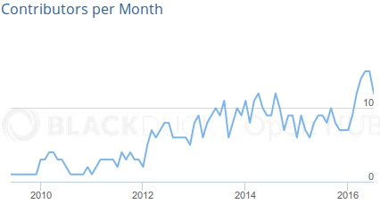

 

---
title: Trace Compass Overview

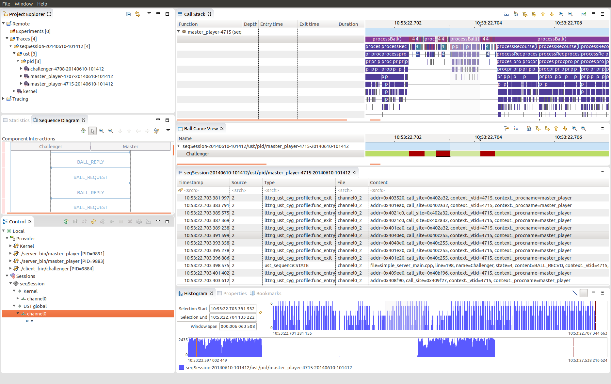

---
title: Trace Compass Overview
subtitle: Common Features

- Management of traces, trace formats and experiments

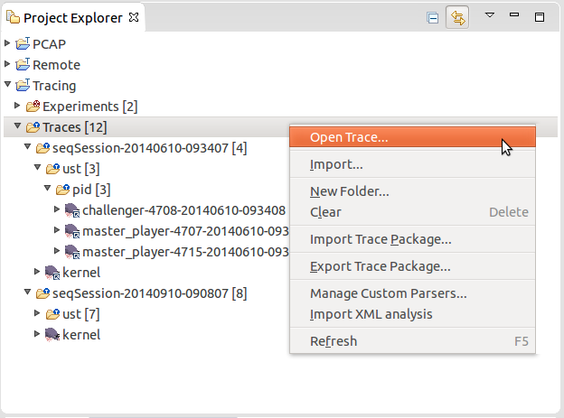

---
title: Trace Compass Overview
subtitle: Common Features

- Package export and import

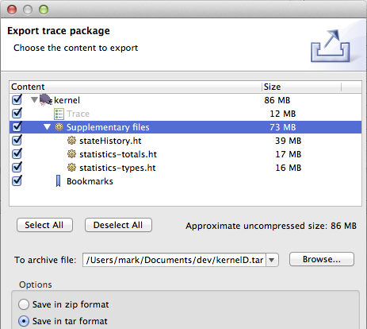

---
title: Trace Compass Overview

- What is a trace in Trace Compass?
	- A Series of **events** over time
	- Each event has content **fields** (payload)

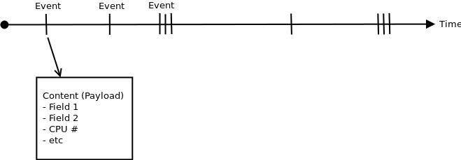

---
title: Trace Compass Overview
subtitle: Common Features

- Events Table
	- Implemented as an Eclipse "editor"

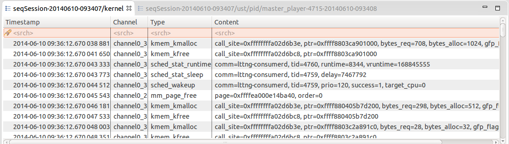

---
title: Trace Compass Overview
subtitle: Common Features

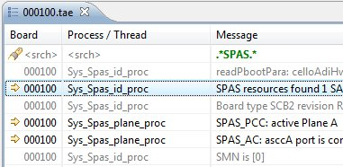

Searching

 

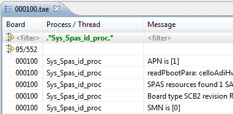

Filtering

 

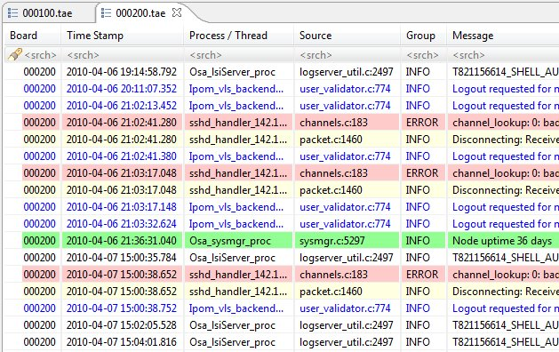

Highlighting

---
title: Trace Compass Overview
subtitle: Common Features

- Bookmarks

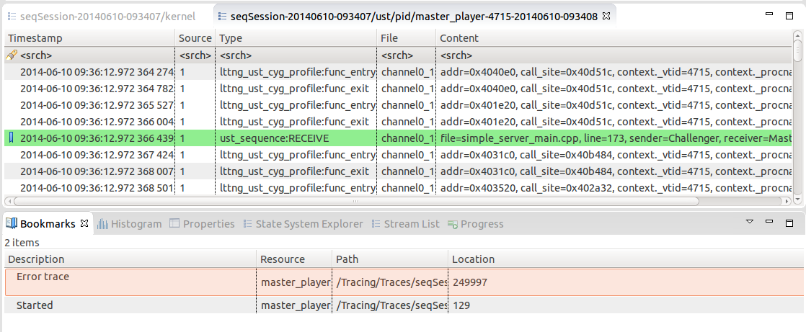

---
title: Trace Compass Overview
subtitle: Common Features

- Sequence Diagrams
	- Translates events to sequence diagram transaction
	- Extensions can define their own model

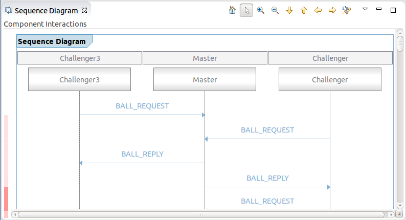

---
title: Trace Compass Overview
subtitle: State System

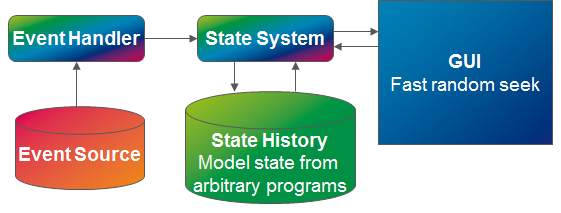

- State system abstracts events, analyses traces and creates models to be displayed

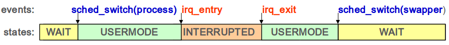

---
title: Trace Compass Overview
subtitle: Control Flow View

- Displays processes state changes (color-coded) over time
	- USERMODE, SYSCALL, INTERRUPED, WAIT_FOR_CPU, etc

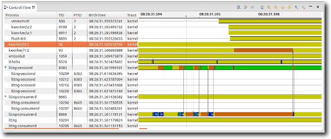

---
title: Trace Compass Overview
subtitle: Resources View

- Displays system resource states (color-coded) over time

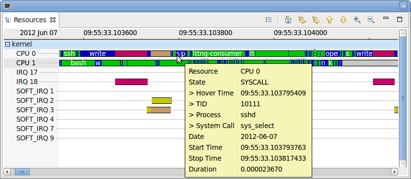

---
title: Trace Compass Overview
subtitle: CPU Usage View

- Displays % of CPU used per thread over time

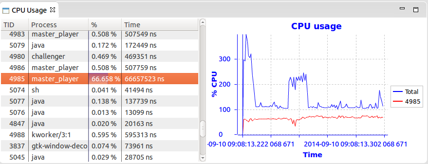

---
title: Trace Compass Overview
subtitle: Call Stack View

- Shows the stack trace at any point during execution

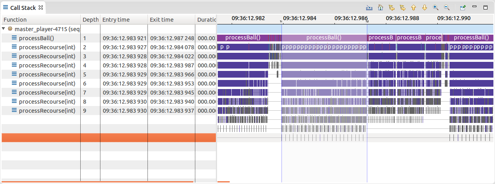

---
title: Trace Compass Overview
subtitle: Critical Path

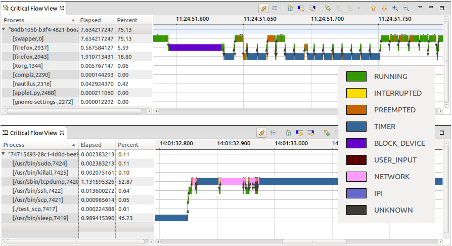

---
title: Trace Compass Overview
subtitle: Timing Analysis

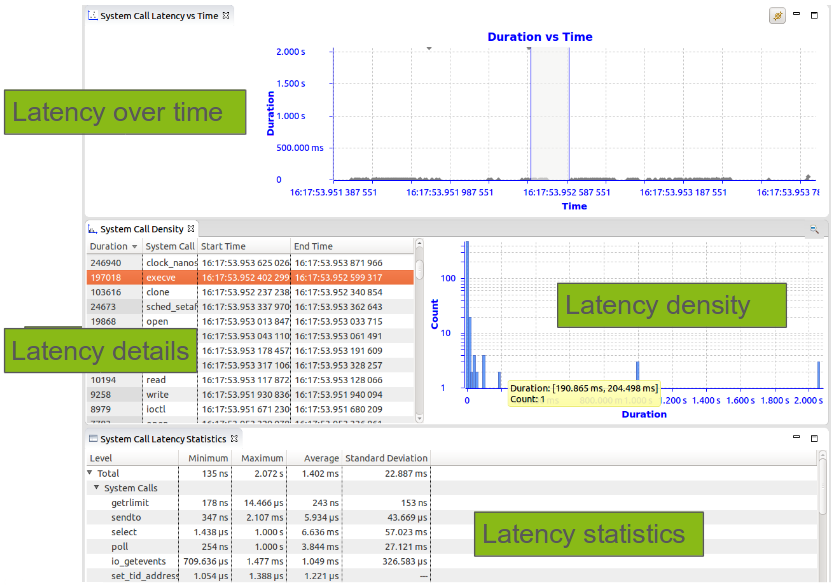

---
title: Trace Compass Overview
subtitle: Custom Text and XML Parsers

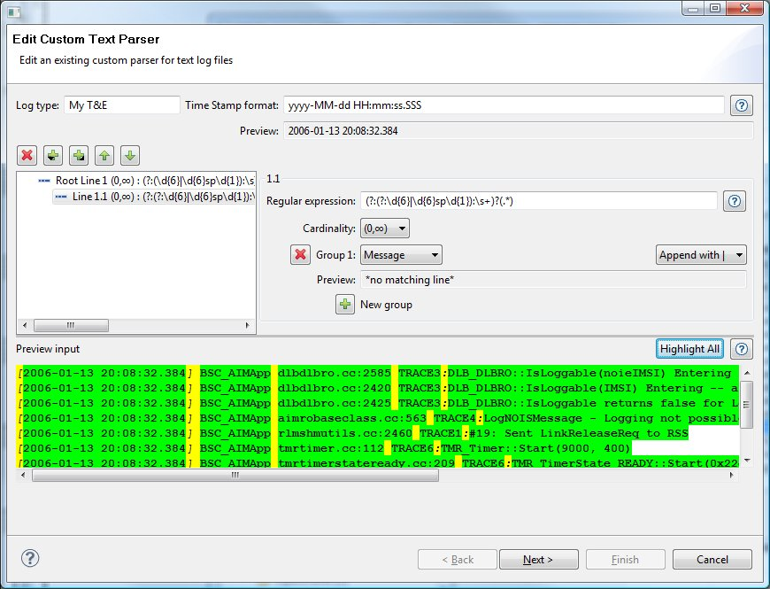

- Line based parser with regex defined in a wizard

- XML based extracting data from XML elements and their attributes

---
title: Trace Compass Overview
subtitle: Integrations

- LTTng (UST, Kernel)
- Text Logs (custom parsers)
- Common Trace Format (Application, kernel, HW, Bare metal)
- Packet Capture
- BTF (Best Trace Format)
- GDB Trace Points

---
title: Trace Compass Overview
subtitle: References

- Project pages
	- <a href="http://tracecompass.org">tracecompass.org</a>
	- <a href="https://dev.eclipse.org/mailman/listinfo/tracecompass-dev">tracecompass-dev mailing List</a>
	- <a href="http://istmffastyet.dorsal.polymtl.ca">Is Trace Compass Fast Yet?</a>
	- <a href="http://lttng.org/">LTTng</a>
	- <a href="http://www.diamon.org/">Diamon Working Group</a>
	- <a href="http://tracingsummit.org/">Tracing Summit</a>

- Documentation
	- <a href="http://archive.eclipse.org/tracecompass/doc/org.eclipse.tracecompass.doc.user/User-Guide.html">Trace Compass User Guide</a>
	- <a href="http://archive.eclipse.org/tracecompass/doc/org.eclipse.tracecompass.doc.dev/Developer-Guide.html">Trace Compass Developer Guide</a>

---
title: Module 2
subtitle: Core Trace API

---
title: Signals

- Classes can register themselves to receive various Trace-related signals
- Uses Java annotation, `@TmfSignalHandler`, to mark method that recieves the signal
- Some signals: `TmfTraceOpenedSignal`, `TmfTraceClosedSignal`, `TmfTraceRangeUpdatedSignal`

~~~java
public void foo() {
    TmfSignalManager.register(this);
}

@TmfSignalHandler
public void traceClosed(TmfTraceClosedSignal signal) {
    ...
}
~~~

---
title: Exercise: Listen to a signal

- Reset to **TRACECOMPASS1**
- Create a class that will receive the signal, `EventReader`
- Instantiate the class. For now, we will do this in the Activator class.
- Register the class with the TmfTraceSignalManager
- Create a `public` method that will receive the signal:
	- Annotate your method with `@TmfSignalHandler`
	- It needs a `TmfTraceOpenedSignal` parameter
	- Make it output something to the console
- <b>Go!</b>
- **TODO**: Show how to test by opening a trace

---
title: Trace API

`ITmfTrace`

- One per trace, a the central object in Trace Compass
- Knows about the key trace attributes: Number of events, file, trace type, etc.
- Allows you to seek at a location in a trace and get events one by one
- Does validation to determine whether or not a file is of this trace type (for
automatic detection, etc)

<image src="images/tracecompass_tmftrace_class.png"/>

---

title: Event Provider

- Event providers have the capability of handling event requests.
- Ofen implemented in pair with ITmfTrace in each trace type
- Of note, `getNext()` provides the next event in the trace

<image src="images/tracecompass_tmfeventprodider_class.png"/>

---
title: Event Requests

`TmfEventRequest`

- Used to obtain series of events from an event provider (usually `ITmfTrace`)
- **Asynchonous**: Send the request and receive events one by one when they are done being parsed

~~~java
eventProvider.sendRequest(new TmfEventRequest(TmfEvent.class,
        0, ITmfEventRequest.ALL_DATA,
        ITmfEventRequest.ExecutionType.BACKGROUND) {

    @Override
    public void handleData(ITmfEvent event) {
        super.handleData(event);
    }
});
~~~

---
title: Exercise: Read events from the trace

- Reset to **TRACECOMPASS2**
- In the signal handler, get the trace object from the signal parameter
- Send an even request to the trace:
	- Create an anonymous class of type `TmfEventRequest`
	- Override handleData and output each event to console
	- When the request is **completed**, output something to the console
- <b>Go!</b>

---
title: Module 7
subtitle: Timing Analysis

---
title: Timing Analysis
subtitle: Concept

- We have two metrics to analyse, what is the data and **when** did it come.
- Every event has **time** info (time stamp), let's take advantage of that.
- Measure time between a **start** and **end** state
	- Simple: Start and end **event**
	- Often: State Machine to determine start and end
	- **Start** and **End** time : **Segment**

- Represent Execution times, latencies, latency chains etc.

---
title: Timing Analysis
subtitle: Why?

- Locate timing problems
- Analyse timing problems
- Find root cause and solution
- Potential delays (find problem before it occurs)
- Difficult to debug if it happens sporadically

---
title: Timing Analysis
subtitle: Example

- System Call Latency, e.g. futex

---
title: Timing Analysis
subtitle: Example

- IRQ Latency

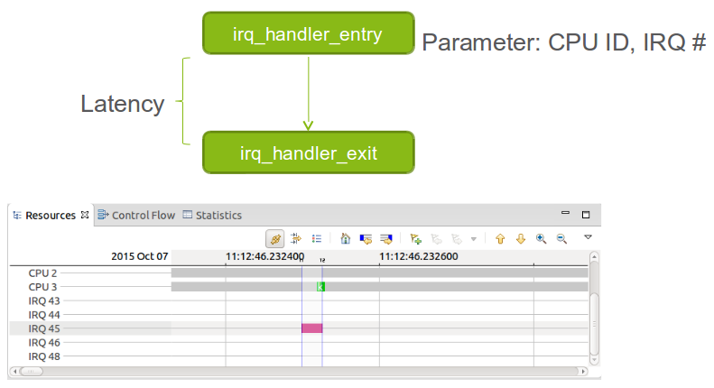

---
title: Timing Analysis
subtitle: Example

- High Resolution Timer – cyclictest application of rt-tests
- Latency between timer expiry till task starts

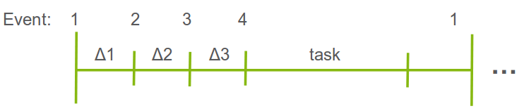

- Latency = Δ1+ Δ2 + Δ3
	- Event 1: Timer expires
	- Event 2: Interrupt handler marks the task to react
	- Event 3: Linux scheduler switches to the task
	- Event 4: Application task begins executing

---
title: Timing Analysis
subtitle: Generalization

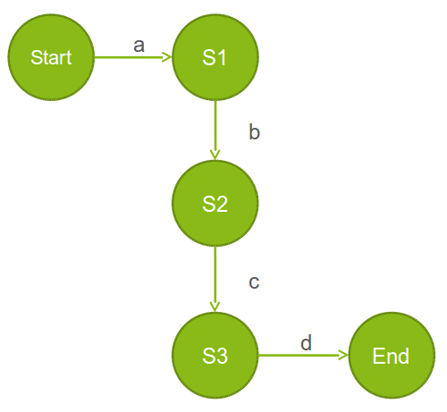

<ul>
<li>Time between start and end</li>
<li>Time for each transition</li>
<li>Percentage sub-duration vs total</li>
</ul>

 

---
title: Timing Analysis
subtitle: Using states

- State machine for timing analysis
	- Implementation in Java as Trace Compass extension

- Data-driven pattern matching (in XML)
	- Defining timing analyses on-the-fly

---
title: Timing Analysis API
subtitle: Segment

---
title: Module 8
subtitle: Timing Analysis Views

