% title: XML Training
% title_class:                      #empty, largeblend[123] or fullblend
% subtitle: And a subtitle
% subtitle_class:
% title_slide_class:
% title_slide_image:
% author: Firstname Lastname
% author: Other info to put on the author line
% thankyou_blend: largeblend3       #largeblend[123] or fullblend
% thankyou_details: Especially thanks to Hilda Ericsson
% mail: firstname.lastname@ericsson.com
% phone: +46 10 xx xx xxx
% sms: +46 72 xx xx xxx
% lync: firstname.lastname@ericsson.com
% footer: Ericsson Internal
% footer: Rev PA1
% footer: 2015-12-15
% logoslide: false
% useBuilds: true
% animate: false         #animate logoslide (chrome only)
% aspect_ratio: 16:9     #16:9, 16:10 or 4:3

---
title: XML analysis basic
subtitle:
content_class: smaller

- The joys of XML analysis
  
    - Customize Trace Compass without recompiling
      
    - Add custom analysis
      
    - Add custom and re-usable views
      
    - Share analysis and views
      
    - Find an execution flow within the trace    

---
title: XML analysis basic
subtitle: Advanced pattern matching
content_class: smaller

- Find stateful sequence within the trace
  
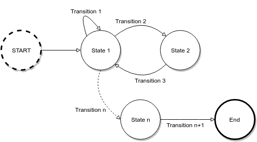

---
title: XML analysis basic
subtitle: Advanced pattern matching
content_class: smaller

- XML description
  
<pre class="prettyprint" data-lang="xml">
    &lt;fsm id="process:processing"&gt;
	    &lt;precondition event="ust_master:PROCESS_START"/&gt;
	    &lt;precondition event="ust_master:PROCESS_END"/&gt;
	    &lt;initialState&gt;
		    &lt;transition event="ust_master:PROCESS_INIT" target="INITIALIZING" action="process_init:save_id"/&gt;
	    &lt;/initialState&gt;
	    &lt;state id="INITIALIZING"&gt;
		    &lt;transition event="ust_master:PROCESS_START" cond="test_id" target="PROCESSING" action="process_start"/&gt;
	    &lt;/state&gt;
	    &lt;state id="PROCESSING"&gt;
		    &lt;transition event="ust_master:PROCESS_END" cond="test_id" target="END" action="process_end"/&gt;
	    &lt;/state&gt;
	    &lt;final id="END"/&gt;
    &lt;/fsm&gt;
</pre>

---
title: XML analysis basic
subtitle: Generic views
content_class: smaller

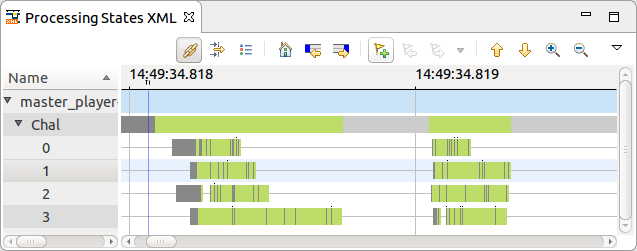

XML Timegraph View

 

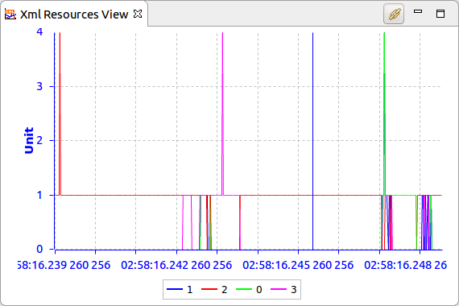

XML XY View

 

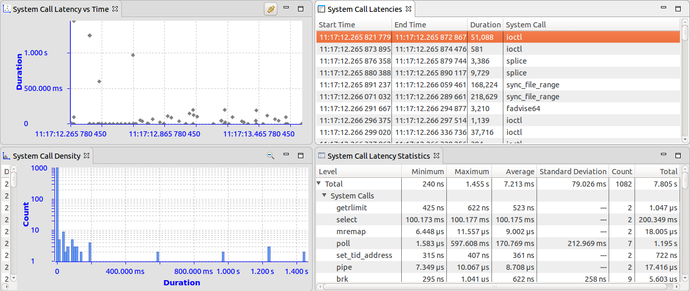

Timing analysis on-the-fly

---
title: How do we use an XML analysis?
subtitle:
content_class: smaller

Define the analysis

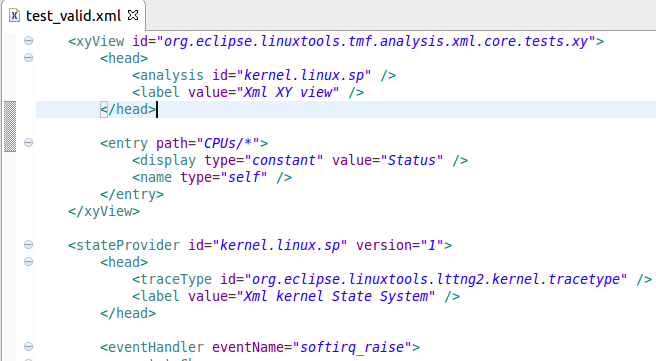

 

Import an XML analysis

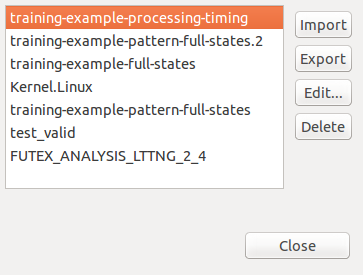

 

Analyze result in Trace Compass

 

---
title: How do we define XML analysis?
subtitle:
content_class: smaller

- Design structure

---
title: Example 1
subtitle:
content_class: smaller

    
**Your first XML analysis**

---
title: Example 1
subtitle: Importing the XML analysis
content_class: smaller

- Reset to commit **blabla**
- In the project explorer,
    - Expand the tracing project
    - Right-click the Traces folder
    - Select `Manage XML analyses...`
    - In the opened dialog import the `training-example-full-states.xml` file and close the dialog.
- The 'Processing Analysis' analysis is now installed
- The analysis should be present under the trace 'master_player-14408-20161020-144931'

---
title: Example 1
subtitle: Importing the XML analysis
content_class: smaller

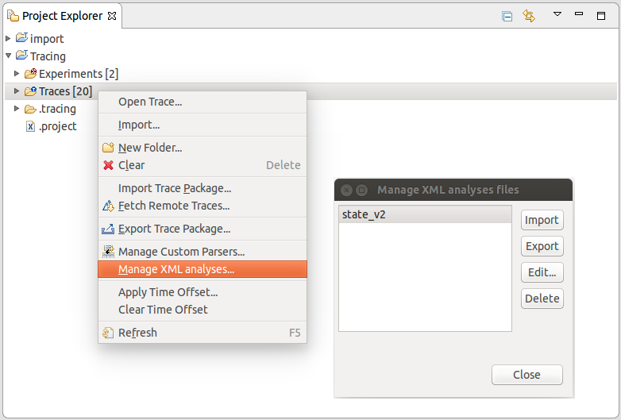

---
title: Example 1
subtitle: Execute the analysis
content_class: smaller

- Open the trace.
    The 'Xml kernel State System' analysis should be now expandable.
  
- Expand the analysis. Several views are present under it:
    - 'Latency statistics' 
    - 'Latency Table'
    - 'Processing States XML'
    - ...
  
- Open the view named `Processing States XML`

---
title: Example 1
subtitle: Importing the XML analysis
content_class: smaller

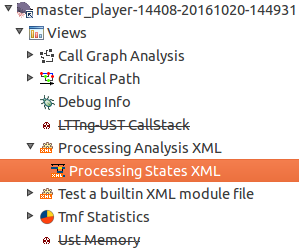

---
title: Example 1
subtitle: Observe the analysis
content_class: smaller

- A timegraph view opens and is `populated`
      
- some `entries (rows) are empty`. Why?

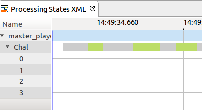
 
**The state system is probably not well designed**
  
  

Next slide: viewing the XML file

---
title: Example 1
subtitle: Edit the analysis
content_class: smaller

- Reopen the 'Manage XML analyses...' dialog (seen previously)
- Select the 'training-example-full-states.xml' file and click on the 'Edit' button

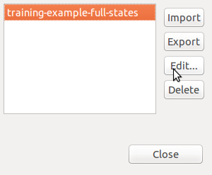

---
title: Example 1
subtitle: Edit the analysis
content_class: smaller

The XML file opens in an editor
 

- We can see that there is few <code>&lt;stateChange&gt;</code> where the  <code>&lt;stateValue&gt;</code> is set to **null**.
<pre class="prettyprint" data-lang="xml">
&lt;stateValue type="null" /&gt;
</pre>

      
- We probably don't want to set the value to **null** for the <code>ust_master:PROCESS_INIT</code> and <code>ust_master:PROCESS_START</code> events.
  
Next slide: editing the XML file

---
title: Example 1
subtitle: Edit the analysis
content_class: smaller

- Change the state value for event <code>ust_master:PROCESS_INIT</code> to <code>INITIALIZING</code>
<pre class="prettyprint" data-lang="xml">
    &lt;stateValue type="int" value="$INITIALIZING"/&gt;
</pre>
 
- Change the state value for event <code>ust_master:PROCESS_START</code> to <code>PROCESSING</code>
<pre class="prettyprint" data-lang="xml">
    &lt;stateValue type="int" value="$PROCESSING"/&gt;
</pre>
 
- Save the file. The opened trace should close. 
 
- Reopen the trace and the view
 

---
title: Example 1
subtitle: Edit the analysis
content_class: smaller

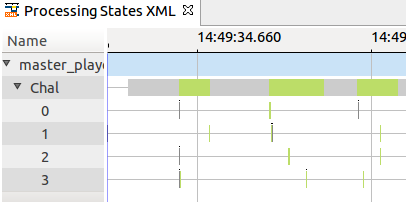

- The view is populated. There is **no empty entry**

---
title: Example 1
subtitle: Recap
content_class: smaller

- We've learned how to `import an XML analysis`
  
- We've learned how to `execute the analysis` and analyze the data
  
- We've learned how to `edit the analysis`

---
title: Example 2
subtitle:
content_class: smaller

**Timing analysis**

---
title: Example 2
subtitle:
content_class: smaller

- Reset to commit **blabla**
  
- Import the 'training-example-processing-timing.xml' file

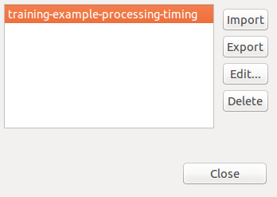

- The 'Processing Latency XML' analysis should be present under the trace
  

---
title: Example 2
subtitle:
content_class: smaller

- Reopen The trace
    - Several views are now present under the analysis.
    
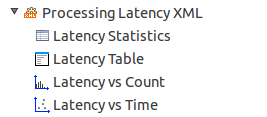

 

- Open the latency views:
    - Latency Statistcis view
    - Latency Table view
    - Latency vs Count
    - Latency vs Time

---
title: Example 2
subtitle: Observe the analysis
content_class: smaller

- All the views are empty
  
**The analysis probably does not create any latency data**
  
  

Next slide: viewing the XML file

---
title: Example 2
subtitle: Edit the analysis
content_class: smaller

- Open the file in an editor
- The file contains an action that creates latency data (segments) in the file

<pre class="prettyprint" data-lang="xml">
    &ltaction id="processing_endeded">
        &ltsegment&gt
          &ltsegType segName="PROCESSING" /&gt
          &ltsegContent&gt
            &ltsegField name="requester" type="string"&gt
              &ltstateValue type="eventField" value="requester" /&gt
            &lt/segField&gt
            &ltsegField name="id" type="string"&gt
              &ltstateValue type="eventField" value="id" /&gt
            &lt/segField&gt
          &lt/segContent&gt
        &lt/segment&gt
      &lt/action&gt
</pre>
**This action is never used**
 
- Next slide: editing the XML file

---
title: Example 2
subtitle: Edit the analysis
content_class: smaller

- We need to call the action when the processing endeded (when we receive the `ust_master:PROCESS_END`event).
  
- Let's add an action to the `ust_master:PROCESS_END` event transition.
 
<pre class="prettyprint" data-lang="xml">
&lt;transition event="ust_master:PROCESS_END" target="end" cond="cond_same_data" action="processing_endeded" /&gt;
</pre>
  
- Save the file. The opened trace should close. 
  
- Reopen the trace and the latency views
  
- The views are now **populated**.
  
- The same latency views and content as the JAVA one

---
title: Example 2
subtitle: Analysis result
content_class: smaller

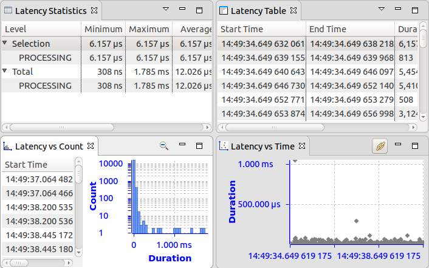

---
title: Example 2
subtitle: Recap
content_class: smaller

- We've learned how to `generate latencies data` from the XML analysis
  
- We've learned how to `analyze latencies` based on XML analysis

---
title: Training recap
subtitle: what we've seen
content_class: smaller

- We've learned how to `import an XML analysis`
  
- We've learned how to `execute the analysis` and analyze the data
  
- We've learned how to `edit the analysis
  
- We've learned how to `generate latencies data` from the XML analysis
  
- We've learned how to `analyze latencies` based on XML analysis